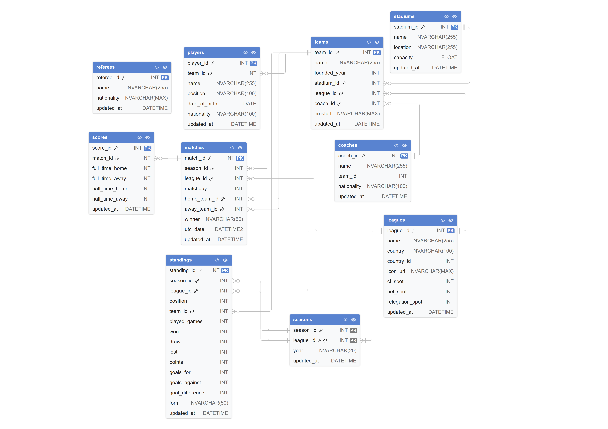
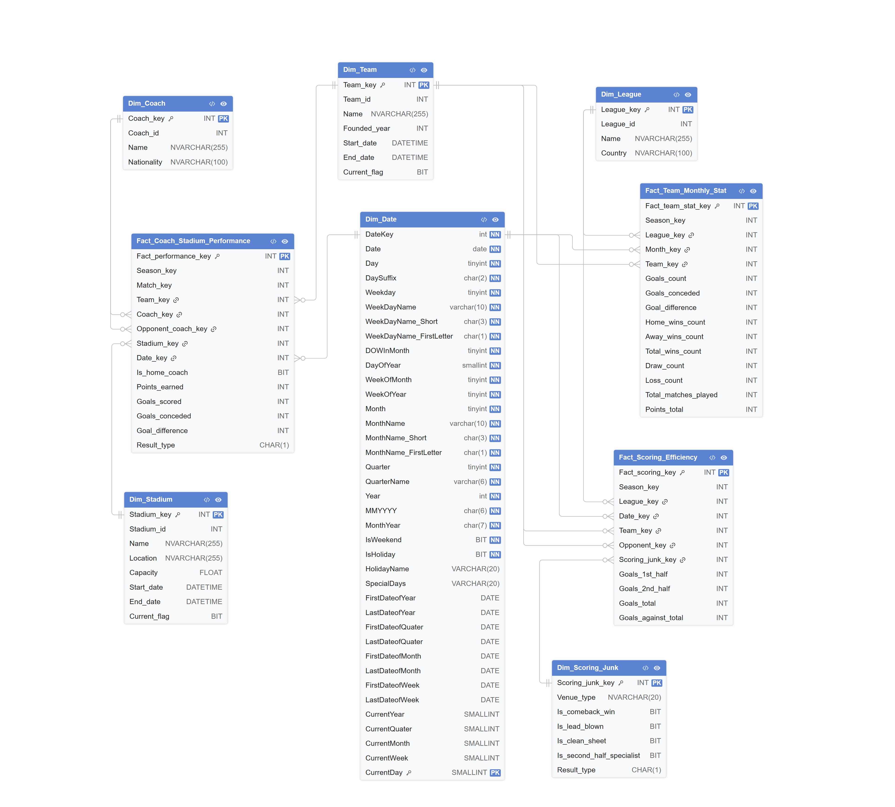
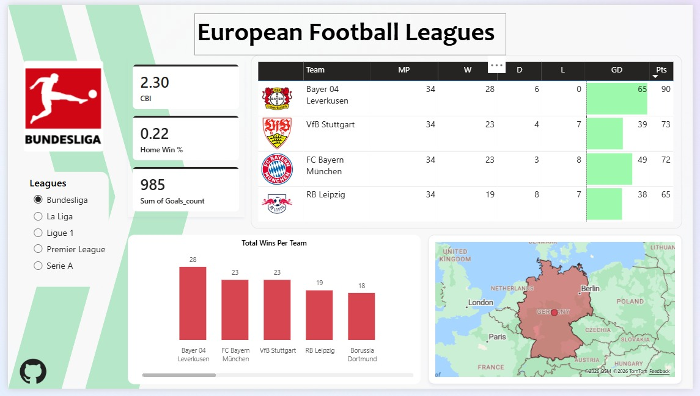
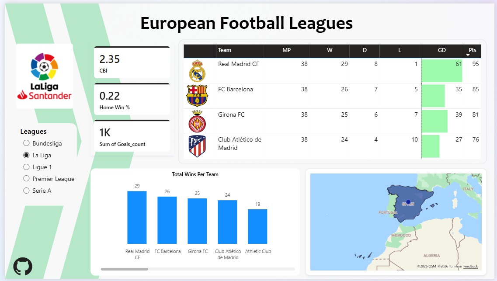
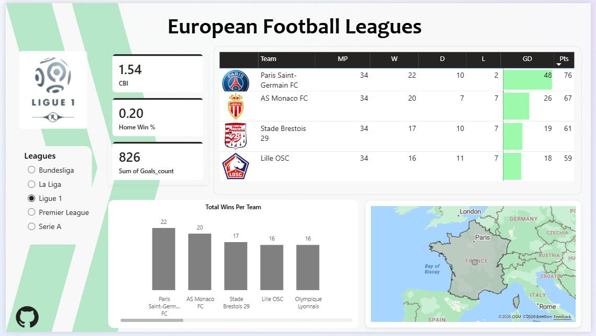
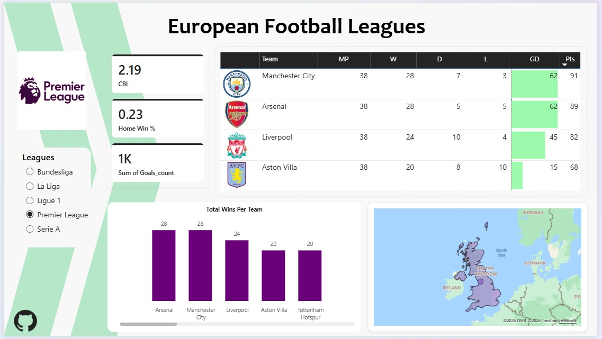
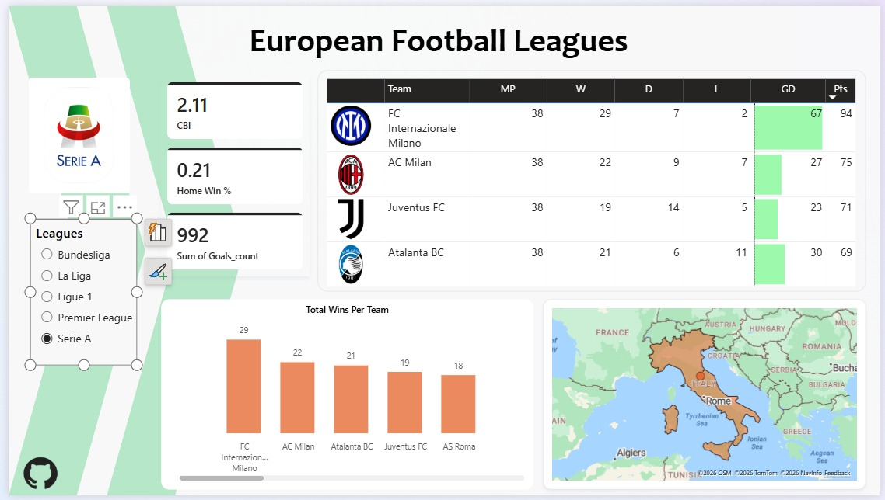

# European Football Leagues - Data Warehouse & ETL Project

<div align="center">


<h3>Data Warehouse & ETL Solution for European Football Analytics</h3>

<p>
Built using SQL Server, SSIS, and Power BI
</p>

</div>

---

# Overview

This project presents a complete **Data Warehouse & ETL solution** for analyzing European football leagues across multiple seasons.

The system transforms operational football data into a centralized analytical warehouse optimized for:

* Team performance analysis
* League analytics
* Coach and stadium insights
* Match efficiency tracking
* KPI reporting and dashboards

The project follows a modern BI architecture consisting of:

```text id="7c5d1m"
OLTP Database → STG Layer → Data Warehouse → Power BI
```

---

# Architecture

## Source System (OLTP)

The source database stores operational football data including:

* Teams
* Matches
* Leagues
* Coaches
* Stadiums
* Scores
* Standings

### OLTP ERD



---

## Staging Layer (STG)

The staging area is responsible for:

* Data extraction
* Cleaning and transformation
* Incremental loading
* KPI preparation
* Data standardization

---

## Data Warehouse (DWH)

The warehouse follows a **Star Schema** design with:

### Dimension Tables

* `Dim_Date`
* `Dim_Team`
* `Dim_League`
* `Dim_Coach`
* `Dim_Stadium`
* `Dim_Scoring_Junk`

### Fact Tables

* `Fact_Team_Monthly_Stat`
* `Fact_Scoring_Efficiency`
* `Fact_Coach_Stadium_Performance`

### Schema Design



---

# ETL Process

The ETL pipeline was implemented using **SQL Server Integration Services (SSIS)**.

## Workflow

```text id="v8m7sk"
Extract → Stage → Transform → Load Dimensions → Load Facts
```

## Features

* Incremental Loading
* SCD Type 2 Support
* Surrogate Key Generation
* Lookup Transformations
* Data Validation & Cleansing
* SSIS Logging & Error Handling

---

# Key Analytics & KPIs

The warehouse supports multiple analytical use cases including:

* Team win rate analysis
* Goals scored vs conceded
* League competitiveness
* Home advantage analysis
* Coach performance metrics
* Stadium impact analysis
* First-half vs second-half performance
* Monthly trend analysis

---

# Power BI Dashboard

An interactive **Power BI Dashboard** was developed to visualize:

* Team performance
* League statistics
* Match trends
* Coach effectiveness
* Scoring efficiency
* Stadium analytics

## Dashboard Screenshots
| Screenshot 1 | Screenshot 2 |
| ------------ | ------------ |
|  |  |
|  |  |
|  |  |

---

# Technologies Used

| Technology  | Purpose              |
| ----------- | -------------------- |
| SQL Server  | Database Engine      |
| SSIS        | ETL Development      |
| Power BI    | Data Visualization   |
| T-SQL       | Data Processing      |
| Star Schema | Dimensional Modeling |

---

# Team Members

| Name                       | GitHub | LinkedIn |
| -------------------------- | ------ | -------- |
| Mohammed Atef Abd El Kader | [Mohammed-3tef](https://github.com/Mohammed-3tef) | [Mohammed Atef](https://www.linkedin.com/in/mohammed-atef-abd-elkader/) |
| Mohammed Ahmed Mohammed    | [mohamedahmed2005](https://github.com/mohamedahmed2005) | [Mohammed Ahmed](https://www.linkedin.com/in/mohamed-ahmed-ba0815307/) |
| Mostafa Ehab Mostafa Akl   | [Eng-M0stafaEhab](https://github.com/Eng-M0stafaEhab) | [Mostafa Ehab](https://www.linkedin.com/in/mustafa-ehab-aql/) |
| Mostafa Mahmoud Fathy     | [mostafa-mahmoud-fathy](https://github.com/mostafa-mahmoud-fathy) | [Mostafa Mahmoud](https://www.linkedin.com/in/mostafa-mahmoud-51b101324/) |

---

# Academic Information

* **Faculty:** Faculty of Computers and Artificial Intelligence
* **University:** Cairo University
* **Course:** IS341 - Data Warehousing
* **Supervisor:** Dr. Ali Zidan

---

# Conclusion

This project demonstrates the implementation of a scalable and analytical football data warehouse using modern Business Intelligence concepts and tools.

The solution integrates ETL processing, dimensional modeling, KPI generation, and interactive reporting into a complete end-to-end BI system.
